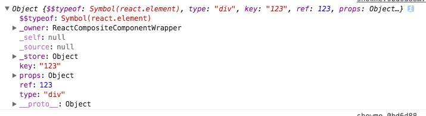
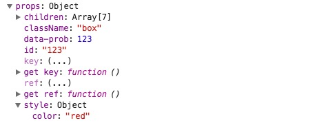

#React源码分析系列

###ReactElement

ReactElement实例化出来的对象，会包含

$$typeof: symbol产生的唯一类型值，主要用它来确认对象是否是ReactElement

type: 一个既可以是html tag也可以是ReactClass的对象

ref: 产生一个组件内对某个dom的一个引用,通过this.refs[refkey]返回HTMLElement

key: 在生产componentkey的时候有用，通过html tag包含key则获取componentkey(请参见traverseAllChildren)的时候将key escape(请参见KeyEscapeUtil),否则根据当前标签在父元素所在位置进行基于36进制的转码(a-z0-9)

props: 开发者挂在标签上的属性都会被放到props，其中style会被解析到props.style的对象内，其中key,ref等为内部属性不会被分别赋值到type,ref中,其中内部属性如下

_owner:返回当前ReactElement是由谁创建的，默认为null，如果是父组件包含子组件，则是ReactCompositeComponentWrapper（这里涉及到React[内部事务](https://github.com/facebook/react/blob/6d5fe44c8602f666a043a4117ccc3bdb29b86e78/src/shared/utils/Transaction.js)形式的为组件创建包裹wrapper的形式,其中每一个事务都包含initialize、close）

_store:存储内部私有数据，初始化后就被冻结（类似常量的形式）， 存储validated、_self、_source皆是不可枚举和修修改的。

相关属性请看下图

<code>

内部保留属性：

var RESERVED_PROPS = {

  key: true,
  
  ref: true,
  
  __self: true,
  
  __source: true
  
};

</code>

ReactElement返回如下接口,部分接口直接作为React的[顶级API](https://facebook.github.io/react/docs/top-level-api.html)

###createElement（type, config, children）
 提供为React使用的，jsx语法中的每一个标签，都会调用createElement，其中type就是ReactClass对象或者html tag（例如div）,config为搜索标签上过滤掉保留属性后的集合，children 子元素/子元素集合。其中值得注意的是jsx语法中的标签包含defaultProps，在ReactElement并没有针对这部分进行描述，但是它存在的意义就是当默认属性为undefined的时候赋默认值(以后找到了补上)，其中向子组件不准许[传递key、ref属性](https://fb.me/react-special-props)
    
 <code>
    
    	// Create dummy `key` and `ref` property to `props` to warn users against its use
    var warnAboutAccessingKey = function () {
      if (!specialPropKeyWarningShown) {
        specialPropKeyWarningShown = true;
        process.env.NODE_ENV !== 'production' ? warning(false, '%s: `key` is not a prop. Trying to access it will result ' + 'in `undefined` being returned. If you need to access the same ' + 'value within the child component, you should pass it as a different ' + 'prop. (https://fb.me/react-special-props)', displayName) : void 0;
      }
      return undefined;
    };
    warnAboutAccessingKey.isReactWarning = true;

    var warnAboutAccessingRef = function () {
      if (!specialPropRefWarningShown) {
        specialPropRefWarningShown = true;
        process.env.NODE_ENV !== 'production' ? warning(false, '%s: `ref` is not a prop. Trying to access it will result ' + 'in `undefined` being returned. If you need to access the same ' + 'value within the child component, you should pass it as a different ' + 'prop. (https://fb.me/react-special-props)', displayName) : void 0;
      }
      return undefined;
    };
    warnAboutAccessingRef.isReactWarning = true;
    
 </code>

###createFactory（type）

对createElement工厂方法实现

###cloneAndReplaceKey（oldElement, newKey）
根据新的key和原有Element进行重新创建对象

###cloneElement

ReactElement对象的深度拷贝

###isValidElement
判断当前对象是否是ReactElement，根据ReactElement的属性$$typeof 确定

###REACT_ELEMENT_TYPE
symbal类型生成的唯一值，确定对象为ReactElement

