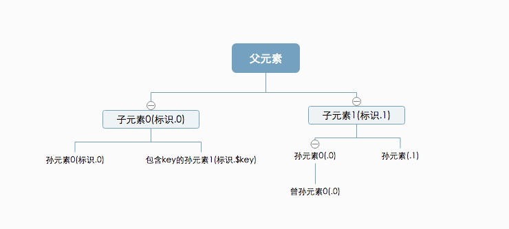

#React源码分析系列

###traverseAllChildren

主要意图在于解析某个节点子节点包含节点个数，形参中的callback回掉搜集该元素的唯一name。
方法说明:

getComponentKey(component, index):

	生成组件的唯一ID,如果component包含key属性则使用escape将key编码作为key，否则根据元素在父元素所在位置基于36位转码。
	
traverseAllChildrenImpl(children, nameSoFar, callback, traverseContext)

	该函数的作用就是某一个元素遍历其子元素生成一个元素唯一的signname，其中signname是调用getComponentKey，然后拼接.。结果比如.1, .2,.0是不是很熟悉，有没有见过html属性中包含data-reactid=".0.0.1"这样的值，就是这么拼接而来的
	children：就是当前节点包含的资源数列表
	nameSoFar:其实就是.0,.1这样的name标识
	callback: 解析回掉
	traverseContext：解析的树节点的上下文（貌似在这里并没有什么卵用）
	返回节点个数

	
traverseAllChildren(children, callback, traverseContext)

	这是该文件暴露的接口，主要就是调用return traverseAllChildrenImpl；

	
这里解析步骤以上图做个举例说明：

第一次调用 traverseAllChildren 首先父元素解析的时候，children中包含两个元素[子元素0， 子元素1],对应内部生成遍历子元素生成.0,.1的标识，返回当前元素下包含2个子元素

第二次调用 traverseAllChildren，children包含[孙元素0，带key的孙元素1]，生成0.2,.$key的标识，回掉对应函数，返回当前包含2个子元素

第三次调用traverseAllChildren，children包含[孙元素0，带key的孙元素1]，对应内部生成遍历子元素生成.0,.1的标识，返回当前元素下包含2个子元素
第四次调用traverseAllChildren，children包含[曾孙元素0]，对应内部生成遍历子元素生成.0的标识，返回当前元素下包含1个子元素
